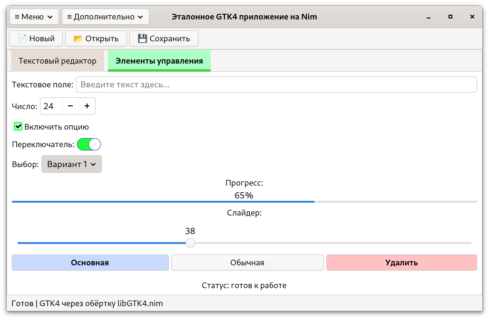
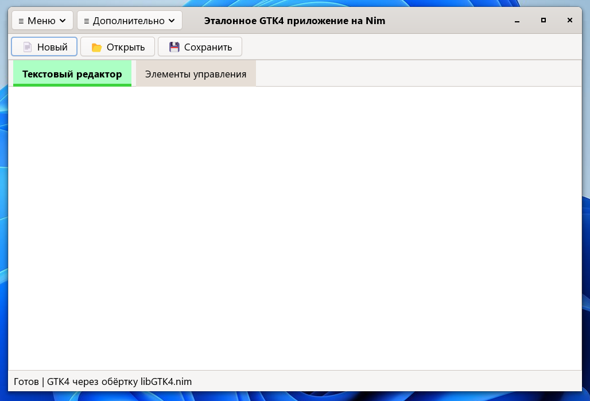

# libGTK4
A full-featured wrapper for the GTK4 library in the Nim programming language

Полновесная обёртка для библиотек GTK4 на языке программирования Nim.

## How it looks on Fedora Linux

## How it looks on Windows 11

## Usage
`nimble install https://github.com/Balans097/libGTK4`

## Documentation

For complete API reference, see [API Reference](docs/libGTK4_API_Documentation_EN.md) (English) or [API Reference RU](docs/libGTK4_API_Documentation_RU.md) (Russian).

## Examples

Check the `examples/` directory for more complete examples demonstrating various widgets and features.

