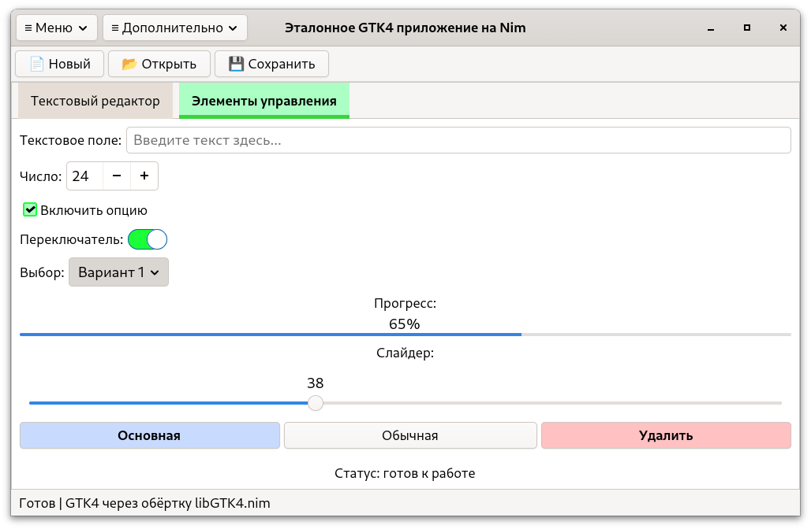
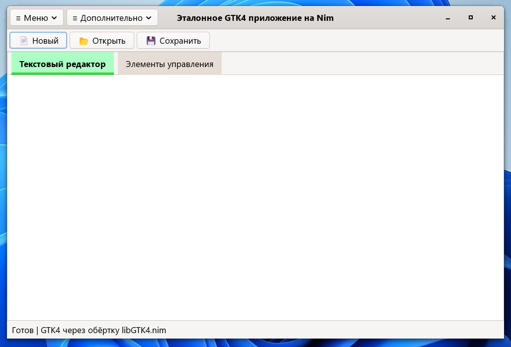

# libGTK4

A full-featured wrapper for the GTK4 library in the Nim programming language.

Полновесная обёртка для библиотек GTK4 на языке программирования Nim.

How it looks on Fedora Linux

How it looks on Windows 11

## Usage
`nimble install https://github.com/Balans097/libGTK4`

## Documentation
**Core API:**
* [API Reference (English)](docs/gtk4_core_reference_en.md)
* [API Reference (Russian)](docs/gtk4_core_reference_ru.md)

**Basic Controls:**
* [Basic Controls Reference (English)](docs/gtk4_basic_controls_reference_en.md)
* [Basic Controls Reference (Russian)](docs/gtk4_basic_controls_reference_ru.md)

**Text Input:**
* [Text Input Reference (English)](docs/gtk4_text_input_reference_en.md)
* [Text Input Reference (Russian)](docs/gtk4_text_input_reference_ru.md)

**Multiline Text:**
* [Multiline Text Reference (English)](docs/gtk4_multiline_text_reference_en.md)
* [Multiline Text Reference (Russian)](docs/gtk4_multiline_text_reference_ru.md)

**Numeric Choice:**
* [Numeric Choice Reference (English)](docs/gtk4_numeric_choice_reference_en.md)
* [Numeric Choice Reference (Russian)](docs/gtk4_numeric_choice_reference_ru.md)

**Display Widgets:**
* [Display Widgets Reference (Russian)](docs/gtk4_display_widgets_reference_ru.md)

**Signals:**
* [GTK4 Signals (Russian)](<docs/Сигналы GTK4.md>)
* [Mouse and Keyboard Signals (Russian)](<docs/Сигналы мыши и клавиатуры.md>)

*The documentation is a work in progress and will keep expanding.*

## Examples
The `examples/` directory contains complete, runnable examples demonstrating various widgets and features:

* [Test_1_Hello_world.nim](examples/Test_1_Hello_world.nim) — minimal "Hello, World!" window with a button click handler
* [Test_2_Text_editor.nim](examples/Test_2_Text_editor.nim) — text editor with a header bar, Open/Save buttons and a file chooser dialog
* [Test_3_Calculator.nim](examples/Test_3_Calculator.nim) — four-operation calculator with a running display
* [Test_4_Drawing.nim](examples/Test_4_Drawing.nim) — freehand drawing on a `GtkDrawingArea` using a Cairo context and drag gestures
* [Test_5_App.nim](examples/Test_5_App.nim) — Conway's Game of Life on a toroidal grid: click to toggle cells, Start/Stop/Step/Randomize/Clear controls, GLib timer-driven simulation
* [Calculator/](examples/Calculator) — addition calculator, built as a standalone binary
* [GUI-0/](examples/GUI-0) — toolbar/status bar demo with a text view, progress bar and custom CSS styling
* [GUI-1/](examples/GUI-1) — freehand drawing test using drag gestures and a Cairo context
* [GUI-2/](examples/GUI-2) — text editor split into modules (entry point, GUI layout, app state and actions/file I/O) to demonstrate structuring a larger app
* [MenuApp/](examples/MenuApp) — application menu and keyboard shortcuts built at runtime from a JSON menu definition
* [Portable GUI for Windows/](examples/Portable%20GUI%20for%20Windows/) — calculator packaged as a portable Windows build, with a launcher that adds the bundled `libs/` directory to `PATH`
